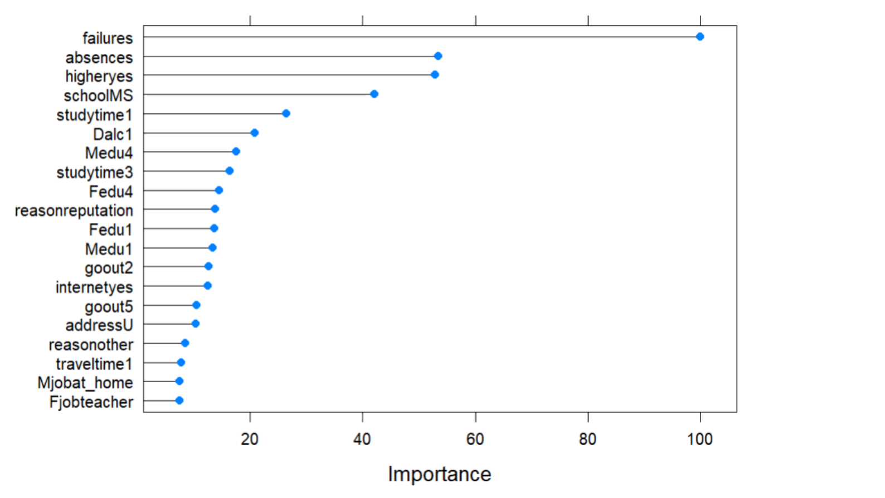
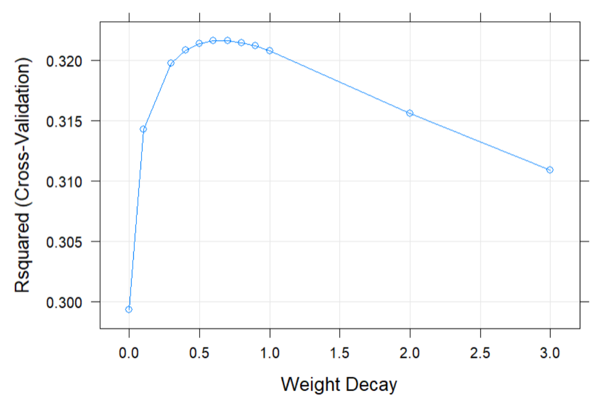
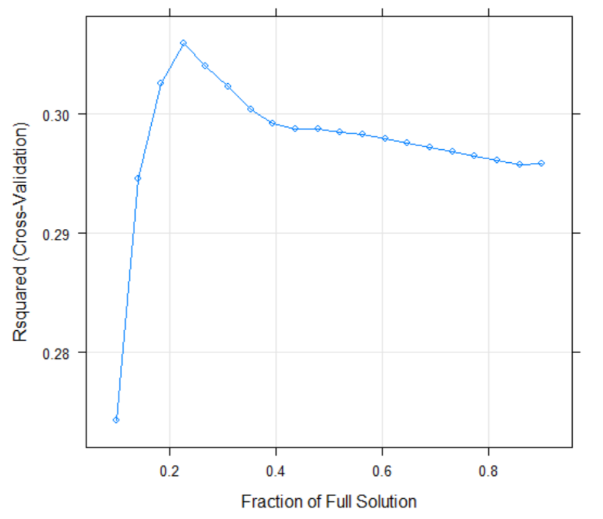
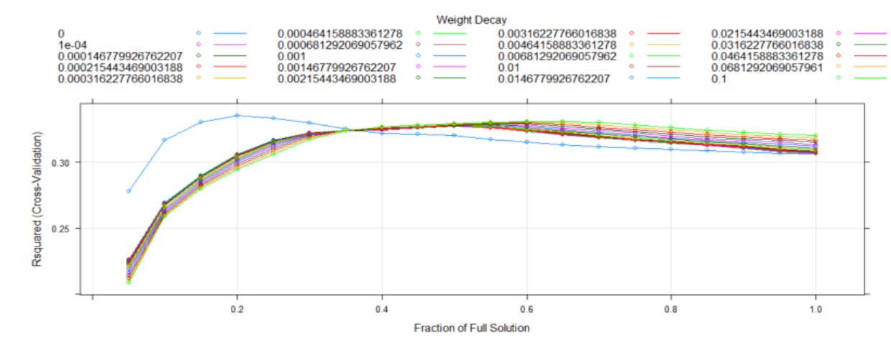
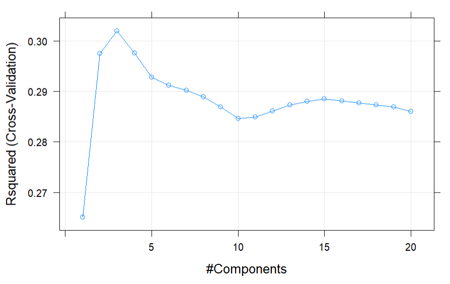
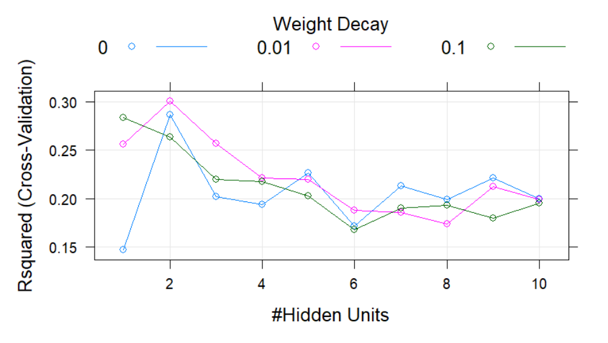
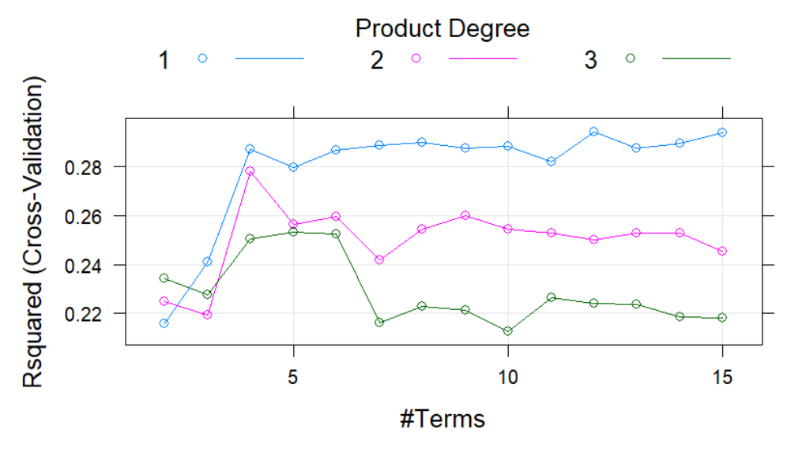
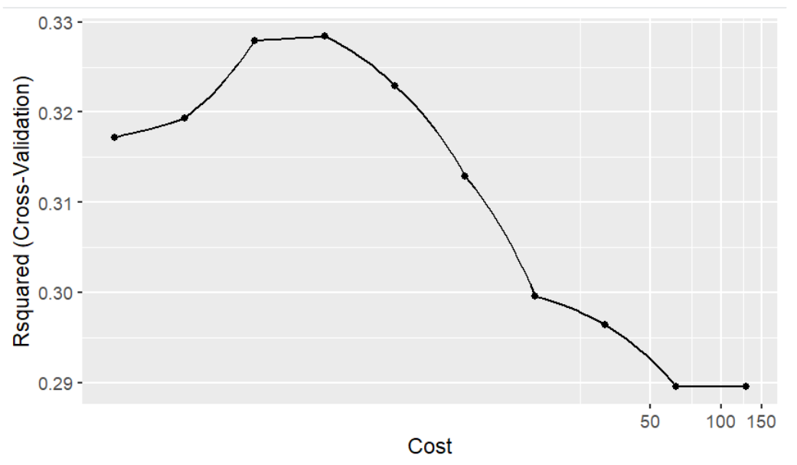
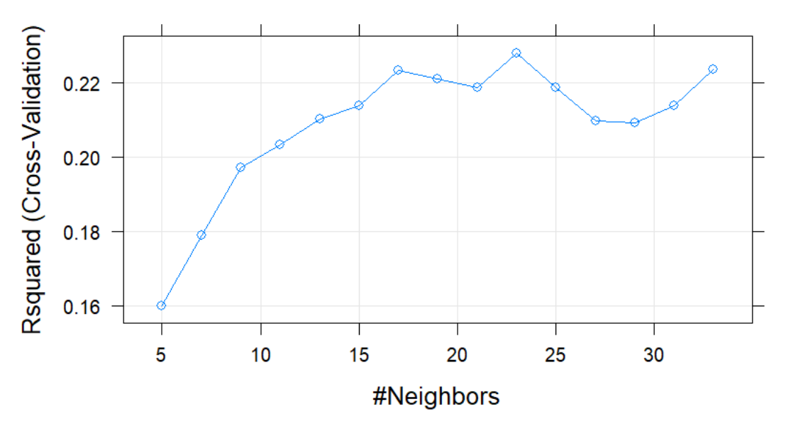

```{r setup, include=FALSE}
knitr::opts_chunk$set(echo = TRUE)
knitr::read_chunk('preprocessing.R')
knitr::read_chunk('modeling.R')
library(caret)
library(e1071)
library(mlbench)
library(corrplot)
setwd("C:\\Users\\kathe\\Documents\\MTU\\Spring2022\\MA 5790\\Final Project")
```

\newpage
## Background

Ensuring student success is the focus for educators in any subject or country. Traditionally, teachers are able to control factors in their classroom, including how they teach, how much they focus on individual students, and other factors. However, there are many contributing factors to student success outside of a teacher’s control. A student’s family situation, lifestyle, and where they live all affect how well a student performs academically. In order to provide better support for students who are struggling, individually and through societal changes, educators and school administrators could benefit from knowing the predicted grade for a student in a course.

In particular, during the early 2000s, Portugal was falling far behind the rest of the EU in education rates, especially early school leaving rate [1]. In order to investigate what factors outside of school were affecting Portuguese students’ academics most, researchers Paulo Cortez and Alice Silva collected questionnaires and grade reports from students in two public schools in Portugal [1]. Cortez and Silva then anonymized this data and made it public through the UCI Machine Learning Repository. 

In this paper, predictive models are applied to the collected background predictors in order to find a model that is able to accurately predict a student’s final grade in Portuguese class given information about their background. 

## Dataset Overview

The original dataset included 30 predictors and three target variables, G1, G2, and G3, for students from two schools, Gabriel Pereira and Mousinho da Silveira, taking either Mathematics or Portuguese. For this paper, only the 649 students taking Portuguese are considered. The three target variables, G1, G2, and G3, represent first period grade, second period grade, and final grade respectively. Since G3 is a combination of G1 and G2, only G3 is considered as a target variable for this paper. All 30 predictors were considered for the model. A description of each predictor in the original dataset is listed in Table 1. 

As seen in the data type, most of the predictors in this dataset are categorical or binary predictors. Many of these categorical predictors are rated on a 1-5 scale or binned in five categories to make collecting questionnaire results easier. The only continuous predictors in this set are age, failures, and absences. 

\newpage
|Predictor|Data Type|Description|
|-|--|-----|
|school|Binary: "GP" or "MS"|Student's school|
|sex|Binary: "F" or "M"|Student's sex|
|age|Continuous: 15-22|Student's age|
|address|Binary: "U" or "R"|Student's home address type|
|famsize|Binary: "LE3" or "GT3"|Family size|
|Pstatus|Binary: "T" or "A"|Parent's cohabitation status|
|Medu|Categorical: 1-5|Mother's maximum education|
|Fedu|Categorical: 1-5|Father's maximum education|
|Mjob|Categorical|Mother's job category|
|Fjob|Categorical|Father's job category|
|reason|Categorical|Reason to select this school|
|guardian|Categorical|Student's primary guardian|
|traveltime|Categorical: 1-5|Home to school travel time (binned)|
|studytime|Categorical: 1-5|Weekly study time (binned)|
|failures|Continuous: 1-4|Number of past class failures|
|schoolsup|Binary: “Yes” or “No”|Whether the student receives extra educational support from the school|
|famsup|Binary: “Yes” or “No”|Whether the student's family provides them extra educational support|
|paid|Binary: “Yes” or “No”|Whether the student takes extra paid Portuguese classes|
|activities|Binary: “Yes” or “No”|Whether the student participates in extracurriculuar activities|
|nursery|Binary: “Yes” or “No”|Whether the student attended nursery school|
|higher|Binary: “Yes” or “No”|Whether the student wants to pursue higher education|
|internet|Binary: “Yes” or “No”|Whether the student has Internet access at home|
|romantic|Binary: “Yes” or “No”|Whether the student is in a romantic relationship|
|famrel|Categorical: 1-5|Quality of family relationships|
|freetime|Categorical: 1-5|Amount of free time after school (binned)|
|goout|Categorical: 1-5|Amount of time spent going out with friends (binned)|
|Dalc|Categorical: 1-5|Quantity of workday alcohol consumption (binned)|
|Walc|Categorical: 1-5|Quantity of weekend alcohol consumption (binned)|
|absences|Continuous: 0-93|Number of school absences

Table: Description of predictors

## Preprocessing

The first preprocessing step was to check for missing values. Figure 1 shows that there are no missing values in this dataset. Therefore, there is no need to perform any imputations. 

```{r preproc-setup, results='hide', echo=FALSE}

```

```{r missing, echo=FALSE, fig.cap="Given the solid figure shown, there are no missing values in this dataset. If there were missing values, there would be sections of the figure that would be black.", fig.height=3, fig.width=4}

```

After determining that there are no missing values in this dataset, the next step is to analyze the starting distributions of each of the three types of predictors to help decide which preprocessing steps were necessary. The three types of predictors included continuous, categorical, and binary variables. These distributions can be found below in Figures 2-4. As shown from these graphs, there appears to be some skewness in the predictors.

```{r original-distribution-continuous, echo=FALSE, fig.cap="The distributions of the Failures and Absences variables appear skewed, while Age tends to follow a normal distribution."}

```

```{r original-distribution-categorical, echo=FALSE, fig.cap="All categorical variables have between 3 and 5 values."}

```

```{r original-distribution-binary, echo=FALSE, fig.cap="The graph of binary predictors is separated from the rest of the categorical predictors simply because they all only have two values and will be encoded in only one dummy variable."}

```

As shown from Figures 2-4, more steps need to be made before models can be built and tuned with the dataset. Dummy variables were then created for the categorical predictors. Originally starting with 14 predictors, after adding dummy variables for all categorical variables there ended up being 65 categorical predictors. For the binary variables, only one column of dummy variables was necessary, leaving 13 binary predictors. Total, there were now 78 categorical predictors to work with and the data is now ready for the next preprocessing step of removing near zero variance for the categorical variables. 

After checking for near zero variance, 8 predictors were removed. Those columns that were removed from the dataset were columns Medu=0, Fedu=0, Fjob=health, traveltime=4, famrel=1, famrel=2, Dalc=4, and Dalc=5, leaving 70 categorical predictors left. 

Once there were no missing values, no near zero variance, and all predictors were encoded as dummy variables, preprocessing on the categorical predictors was finished. The focus now shifts to finishing the preprocessing steps on the continuous predictors.  

Looking at the continuous variables, adjustments need to be made for skewness and non-normal distributions. A Box and Cox transformation was used to correct for the skewness and can be visualized as found in Figure 5. Figure 5 shows the before and after transformation distributions for failures and absences. Age was left out from the transformation since it already showed an approximately normal distribution.

```{r apply-boxcox, echo=FALSE, results='hide'}

```


```{r boxcox-beforeafter, echo=FALSE, fig.cap="The Box and Cox transformation made a large difference in the absences distribution towards a more normal distribution, but the distribution of failures didn’t seem to change much since failures are so strongly skewed.", fig.height=4, fig.width=5}

```

As seen in Figure 5, there is still some adjustment needed for the predictors. The next step was to perform centering and scaling on the continuous predictors. The effects of the transformation on the continuous predictors can be seen below in Figure 6. 

```{r apply-centerscale, echo=FALSE, results='hide'}

```


```{r after-centerscale, echo=FALSE, fig.cap="The distributions of the variables are now within the same approximate range.", fig.height=6, fig.width=4}

```

Once these transformations had all been completed, the next preprocessing step was to remove highly correlated predictors from all of the different types of variables. In removing highly correlated predictors, a cutoff value of 0.85 was appropriate. Any variables that then had a correlation higher than 0.85 were removed. A visual representation of the correlation plot can be seen below in Figure 7.

```{r dummyvars, echo=FALSE, results='hide'}

```

```{r corrplot, echo=FALSE, fig.cap="The above image shows that only Guardian_father and Guardian_mother are highly correlated."}

```

Figure 7 shows that there were only two variables that were highly correlated with each other, Guardian_father and Guardian_mother. Since these were the only two highly correlated predictors we only needed to remove one of them, so we decided to remove Guardian_father from our dataset. Since the options for guardianship in the original data collection were only mother, father, or other - with other being a rare occurrence - it makes sense to remove Guardian_father. Choosing either Guardian_father or Guardian_mother would have resulted in very similar results.

The final preprocessing step was to deal with the outliers present in the continuous variables. Using a spatial sign transformation, and visualizing the transformations with boxplots, Figure 8 below shows the continuous predictors after the spatial sign transformation. While these graphs appear to show that outliers still remain, it is important to take into account that spatial sign makes the transformation in 3D space where these visualizations are only in 1D space. 

```{r apply-highlyCorrelated, echo=FALSE, results='hide'}

```

```{r spatialSign, echo=FALSE, fig.cap="Boxplot images of Age, Absences, and Failures variables after a spatial sign transformation has been performed.", fig.height=4, fig.width=4}

```

Overall, preprocessing came about through a few steps, starting with checking for missing values. Next, 65 predictors were added for our categorical dummy variables and eight predictors with near zero variances were removed. Additionally, Box and Cox transformations as well as centering and scaling, were applied to the continuous variables of absences and failures. One highly correlated predictor was removed from the dataset after checking for correlations greater than 0.85. Finally, a Spatial Sign transformation was applied to all the continuous predictors to remove outliers. After all of these preprocessing steps were completed, the dataset was left with 72 predictors (3 continuous and 69 categorical) and 649 observations. 

## Data Spending

The target variable G3 follows a normal distribution with several outliers. This can be seen in Figure 9 below, with G3 having a range of integers from 0 to 20, with several outliers at 0. 

```{r distribution-target, echo=FALSE, fig.cap="The target variable follows a normal distribution with several outliers at 0.", fig.height=2.5, fig.width=3}

```

In order to not under-represent these outliers, stratified random sampling is used to account for the uneven distribution. The dataset is then split into 80% training and 20% testing sets so that there are more samples in the training set given the generally small number of observations. Data resampling will be done using 10-fold cross validation on the training data for selecting top models and tuning parameters.

## Models

For this problem, a regression model should be fit to the dataset. The target variable is composed of integers, so a categorical model would be possible, but there is an important numeric relationship between each grade that must be included in the model. Thus, regression models will be used for this dataset. Nine different models were fit to this data, five linear models; linear model, lasso model, elastic net (ENET) model, ridge regression model, partial least squares (PLS); and four non-linear models; a neural network, a multivariate adaptive regression spline (MARS) model, a support-vector machine (SVM), and a k-nearest neighbors (KNN) model. A summary of each model, the optimal parameters for the model, and the summary statistics on the training set are listed in Table 2 below. For parameter plots for each model, see Appendix A. 

|Model|Optimal Parameters|RMSE|$R^2$|
|--|----|-|-|
|Linear Model| |2.7995|0.3069|
|PLS|ncomp = 3|2.7702|0.3020|
|LASSO|fraction = 0.1|2.7956|0.3056|
|ENET|fraction = 0.4, $\lambda=0.1$|2.613|0.3356|
|Ridge|$\lambda=0.6$|2.8037|0.3216|
|Neural Network|hidden units = 2, $\lambda=0.01$|2.8092, 0.3006|
|MARS|degree = 1, terms = 12|2.7986|0.2941|
|SVM|cost = 2, $\sigma=0.007526$|2.7080|0.3284|
|KNN|k = 23|2.9420|0.2278|

Table: Summary of model performance on the training data

In order to select the model that explains the most variance in the data, the model with the highest R2 will be selected. As seen in Table 2, the two best models on the training set are ENET and the SVM. These two models were then used to predict the test set. Results for predictions on the test set are in Table 3. After calculating the performance on the test set, the SVM was selected as the best regression model for this dataset. 

\newpage

|Model|Optimal Parameters|RMSE|$R^2$|
|--|----|-|-|
|ENET|fraction = 0.4, $\lambda=0.1$|2.5506|0.3056|
|SVM|cost = 2, $\sigma=0.007526$|2.5073|0.3207|

Table: Summary of model performance on the test data

```{r pressure, echo=FALSE, fig.cap="The top 20 most important predictors for the SVM"}

```

From the SVM, the twenty most important variables are shown in Figure 10. Though the graph shows the best twenty predictors, only the five best predictors will be discussed here since the next fifteen are all of similar importance. By far, the most important predictor to the SVM was the number of previous failures. This makes sense, because students who had previously failed courses might be more likely to do poorly in the current course. The next most important predictor was the number of absences the student had. Again, logically, if a student cannot attend many classes, they are more likely to do poorly. The number of absences was closely followed by whether or not the student wanted to pursue secondary education. Next is the predictor schoolMS, which represents which of the two schools the student attends. This implies that, for the SVM, which school a student attends is more important to what grade they get over almost all of the other background predictors. Though we did not do any analysis on how the grades vary between schools, we would be interested to see if there appears to be any significant difference. Finally, the fifth most important predictor was how much time a student spends studying. Though the schoolMS predictor being very important was surprising, the other four of the most important predictors make sense given what we know about how students learn and succeed academically.

## Conclusion

The best model on this data is the non-linear SVM model. The top 5 most important predictors for the SVM model were the number of failures, number of absences, decision to pursue higher education, which school the student attends, and how much time the student spent studying. While it was the most successful model, it only achieved an R2 of 0.3207 on the test set, which is not ideal. Additionally, the RMSE for the SVM model was 2.5 with no model achieving an RMSE lower than 2.5. Since we only have a range from 0-20 in our target variable, an RMSE over 2 is extremely high. This could be caused by many factors including our small sample size, how students who come from the same backgrounds may have high differences in grades, what works well for one student to learn doesn’t necessarily mean that the same technique will work for another student, or simply that people can be unpredictable. Due to the low R2 of the SVM model, we do not recommend it for future use. 

In order to achieve better results, a model could be created for each high school in order to determine if there were significantly different patterns depending upon which school the student attends. Another option would be to fit a categorical model to the data to see if a categorical model could produce better results than a linear model. We could also try running our models with both of the other target variables included, similar to the original dataset authors. They were able to obtain better results, however they also used G1 in their predictor set which could make a major difference, as the first quarter grades are added to the second quarter grades to obtain the final grade. However, we are reluctant to add grade variables to the predictor set for fear that it would detract from the goal of predicting grades based solely on students’ background factors. 

\newpage
## Appendix A: Supplemental Material for Regression Models

```{r, echo=FALSE, fig.cap="Ridge Model: Optimal lambda = 0.6", fig.height=3}

```

```{r, echo=FALSE, fig.cap="Lasso Model: Optimal fraction = 0.2263", fig.height=3}

```

```{r, echo=FALSE, fig.cap="Elastic Net Model: Optimal fraction = 0.2, lambda = 0"}

```

```{r, echo=FALSE, fig.cap="Partial Least Squares Model: Optimal ncomp = 3"}

```

```{r, echo=FALSE, fig.cap="Neural Network: Optimal number of hidden units = 2, lambda = 0.01"}

```

```{r, echo=FALSE, fig.cap="MARS Model: Optimal degree = 1, number of terms = 12"}

```

```{r, echo=FALSE, fig.cap="SVM Model: Optimal cost = 2"}

```

```{r, echo=FALSE, fig.cap="KNN Model: Optimal k = 23"}

```

\newpage
## Appendix B: R Code

```{r, file='preprocessing.R', eval=FALSE}

```

```{r, file='modeling.R', eval=FALSE}

```

\newpage
## References

[1] P. Cortez and A. Silva. Using Data Mining to Predict Secondary School Student Performance. In A. Brito and J. Teixeira Eds., Proceedings of 5th FUture BUsiness TEChnology Conference (FUBUTEC 2008) pp. 5-12, Porto, Portugal, April, 2008, EUROSIS, ISBN 978-9077381-39-7.

